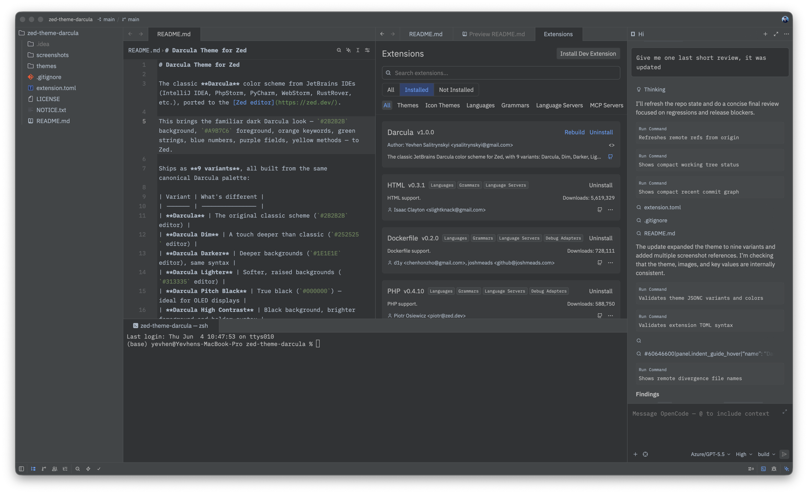
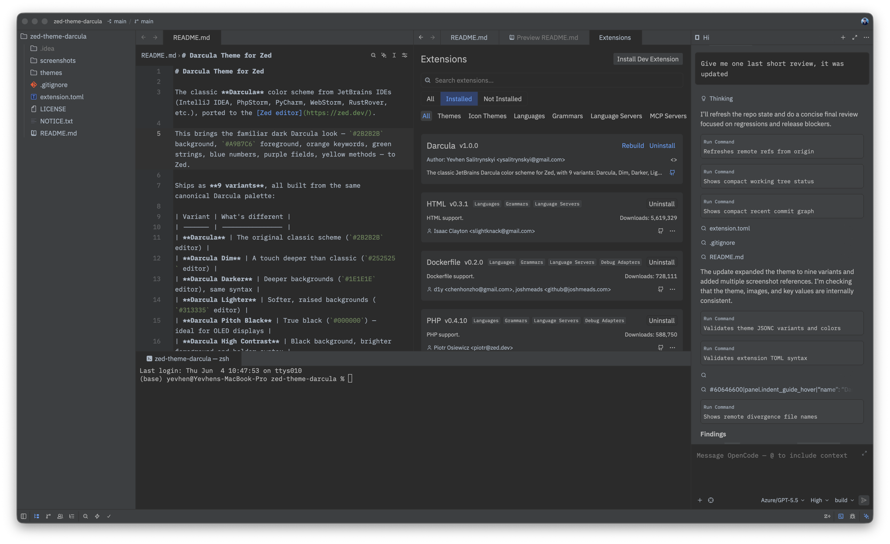
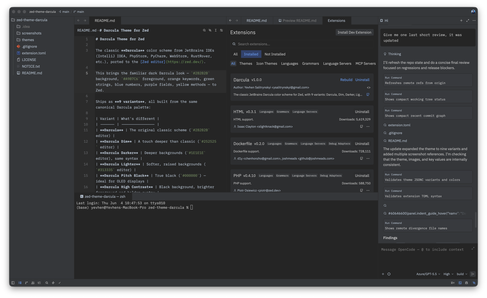
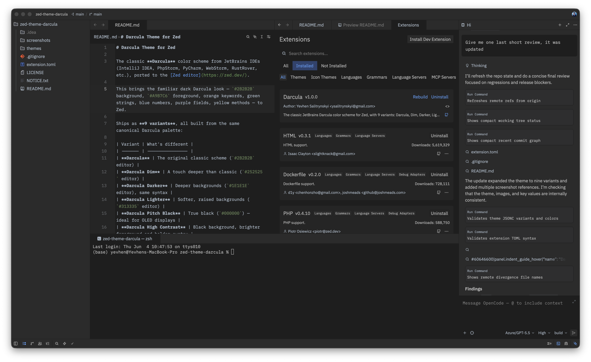
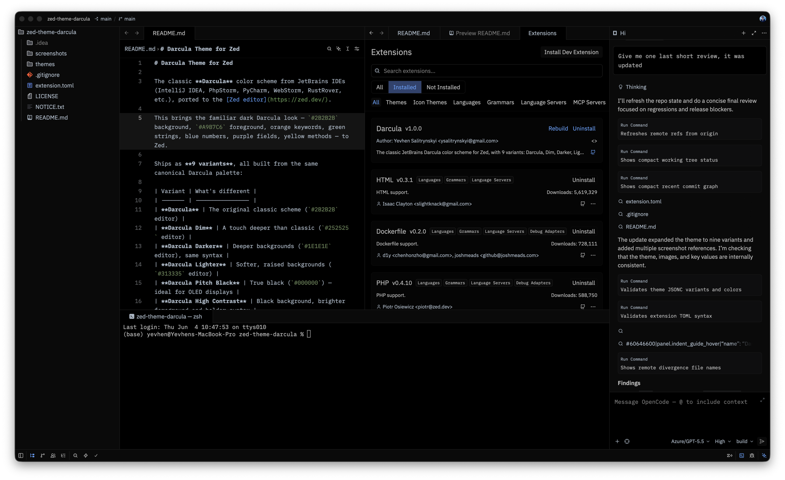
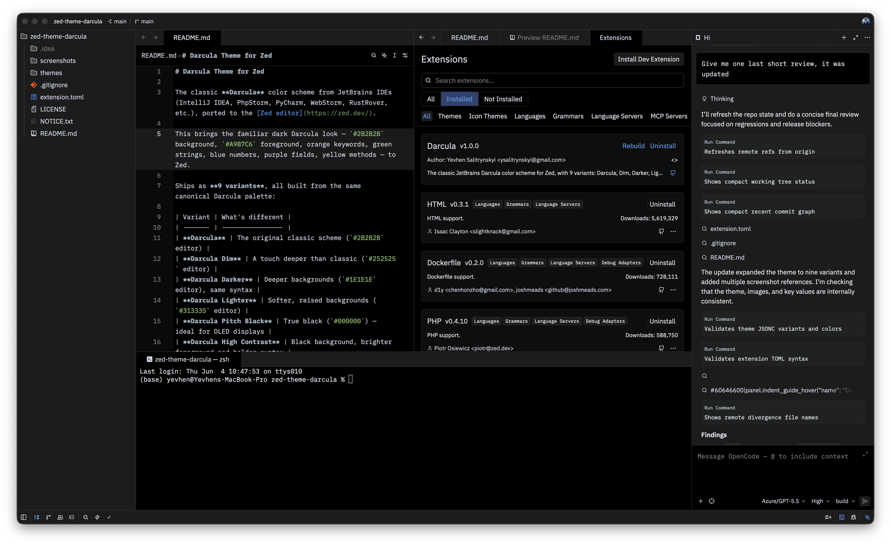
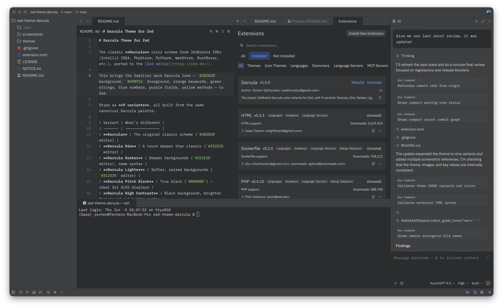
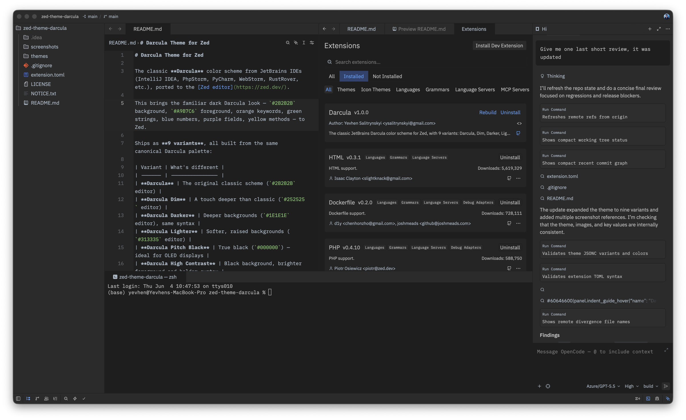
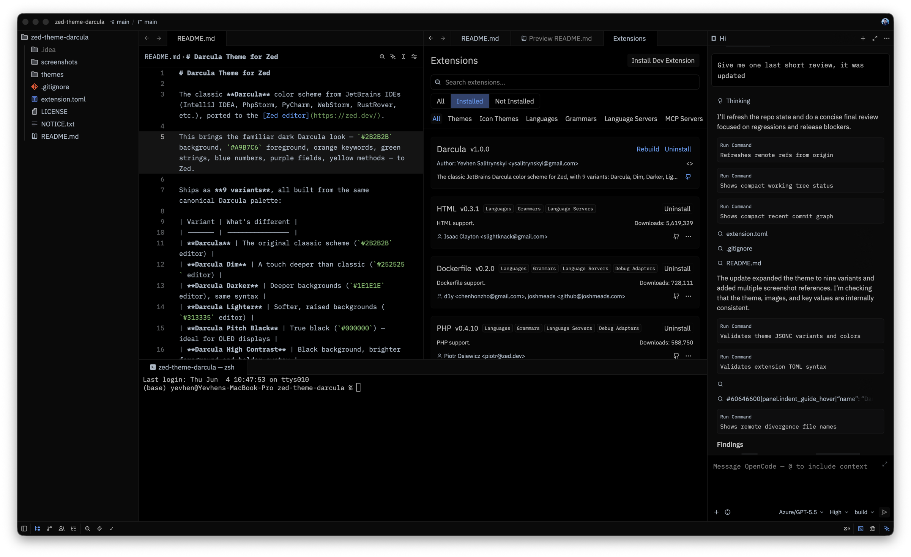

# Darcula Theme for Zed

The classic **Darcula** color scheme from JetBrains IDEs (IntelliJ IDEA, PhpStorm, PyCharm, WebStorm, RustRover, etc.), ported to the [Zed editor](https://zed.dev/).

This brings the familiar dark Darcula look — `#2B2B2B` background, `#A9B7C6` foreground, orange keywords, green strings, blue numbers, purple fields, yellow methods — to Zed.

Ships as **9 variants**, all built from the same canonical Darcula palette and listed here from lightest to darkest within each family.

### Classic

| Variant | Editor background |
| ------- | ----------------- |
| **Darcula Lighter** | `#313335` — softer, raised background |
| **Darcula** | `#2B2B2B` — the original classic scheme |
| **Darcula Dim** | `#252525` — a touch deeper than classic |
| **Darcula Darker** | `#1E1E1E` — deeper background |
| **Darcula Pitch Black** | `#000000` — true black, ideal for OLED |

### High Contrast

| Variant | Editor background |
| ------- | ----------------- |
| **Darcula High Contrast** | `#000000` — black background, brighter foreground and bolder syntax |

### Vivid (more saturated syntax)

| Variant | Editor background |
| ------- | ----------------- |
| **Darcula Vivid** | `#2A2C2E` — vivid syntax on the classic background |
| **Darcula Vivid Darker** | `#1E1E1E` — vivid syntax on a deeper background |
| **Darcula Vivid Black** | `#000000` — vivid syntax on true black |

## Previews

### Darcula Lighter

### Darcula

### Darcula Dim

### Darcula Darker

### Darcula Pitch Black

### Darcula High Contrast

### Darcula Vivid

### Darcula Vivid Darker

### Darcula Vivid Black

## Installation

### From the Zed extension registry

1. Open Zed
2. Press `Cmd+Shift+P` (macOS) or `Ctrl+Shift+P` (Linux/Windows) → **Extensions: Install Extensions**
3. Search for **Darcula**
4. Click **Install**

### Manually (install as a dev extension)

1. Clone this repo
2. In Zed, run **zed: install dev extension** from the command palette
3. Select this folder

## Activating the theme

1. Press `Cmd+K` `Cmd+T` (macOS) or `Ctrl+K` `Ctrl+T` (Linux/Windows)
2. Select any variant from the list

> **Note:** Zed's theme picker lists themes alphabetically, so in-app the variants appear sorted by name rather than by brightness.

## Palette

Base palette (shared by all variants unless noted):

| Token             | Color     |
| ----------------- | --------- |
| Background        | `#2B2B2B` |
| Foreground        | `#A9B7C6` |
| Keyword           | `#CC7832` |
| String            | `#6A8759` |
| Number            | `#6897BB` |
| Comment           | `#808080` |
| Doc comment       | `#629755` |
| Field / property  | `#9876AA` |
| Function / method | `#FFC66D` |
| Annotation        | `#BBB529` |
| Tag               | `#E8BF6A` |
| Selection         | `#214283` |

## License

Theme code released under the [Apache 2.0 license](./LICENSE). Darcula is a JetBrains color scheme — see [NOTICE.txt](./NOTICE.txt). This is an unofficial port, not affiliated with JetBrains.
